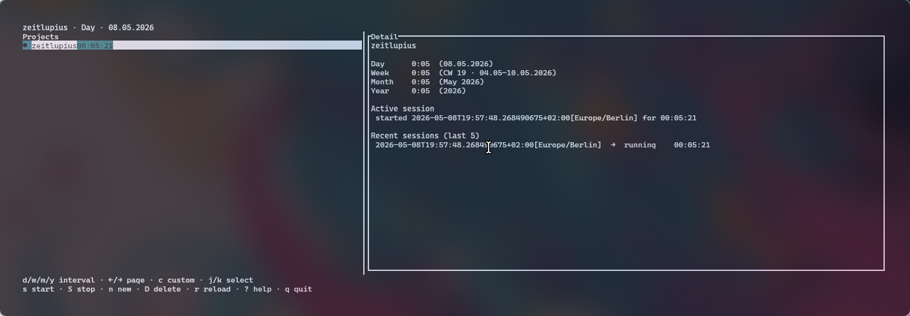

# zeitlupius

Terminal time tracking — a Ratatui TUI plus a feature-equivalent CLI. Each project's sessions live in a CSV under `~/.zeitlupius/projects/`.

## Install

    cargo install --path .

## Usage

Launch the TUI:

    zeitlupius

Or use the CLI:

    zeitlupius create rust-zlp
    zeitlupius start  rust-zlp
    zeitlupius start  rust-zlp --note "pairing on the parser"
    zeitlupius stop   rust-zlp
    zeitlupius status
    zeitlupius report --week
    zeitlupius report --from 18.04.2024 --to 16.07.2024

## Notes

Attach a short note to a session for context. Start a timer with `--note`, or
add, edit, or clear the note on any existing session afterwards.

    zeitlupius session list rust-zlp                       # shows IDs and notes
    zeitlupius session set-note rust-zlp <id> --note "..."  # add or edit a note
    zeitlupius session set-note rust-zlp <id>               # clear the note

In the TUI, focus the Sessions panel (`Tab`), select a session, and press `e` to
edit its note. Notes appear inline in the Sessions and Detail panels.

## Data directory

Override the data directory:

    zeitlupius --data-dir /path/to/dir <subcommand>
    ZEITLUPIUS_HOME=/path/to/dir zeitlupius
